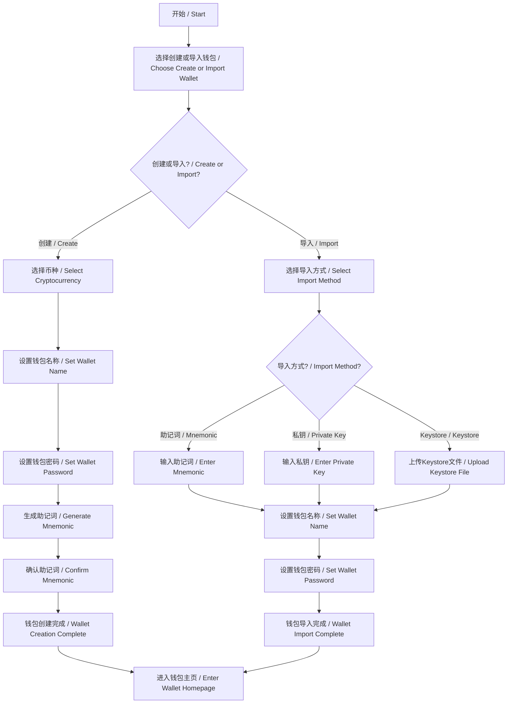
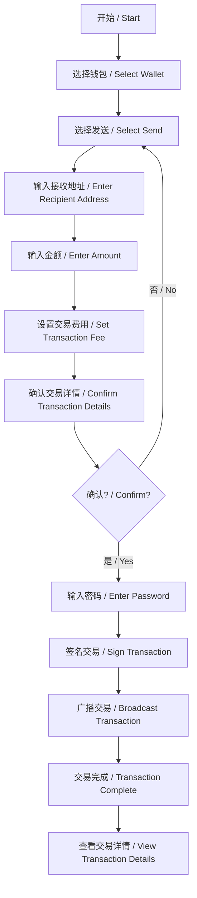
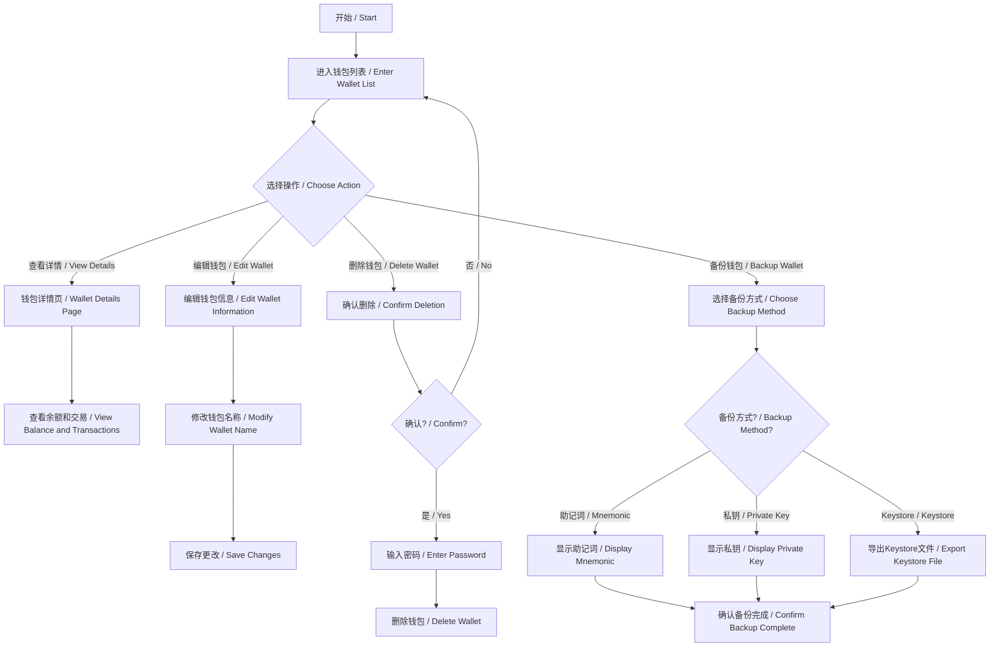
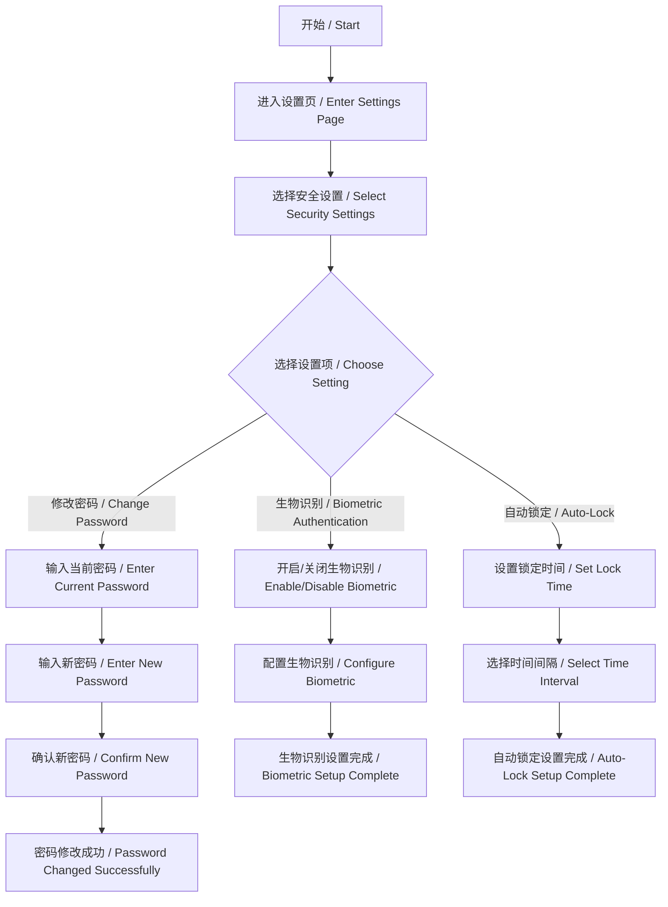
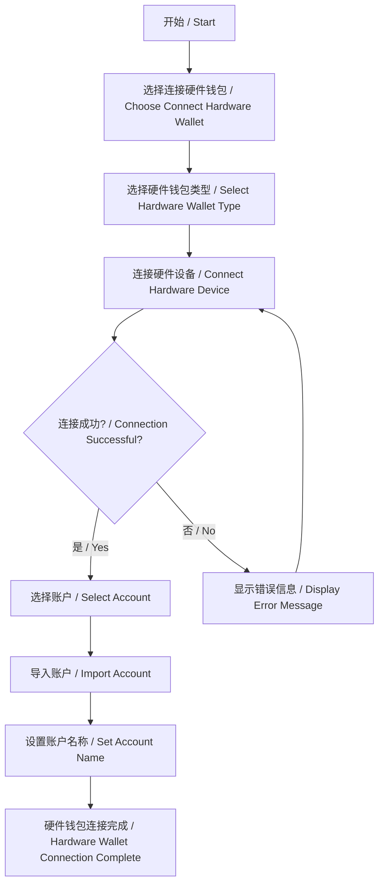

# 多链加密货币钱包产品流程图和UI设计图 / Multi-Chain Cryptocurrency Wallet Product Flow and UI Design

## 目录 / Table of Contents
1. [产品概述 / Product Overview](#产品概述--product-overview)
2. [用户流程图 / User Flow Diagrams](#用户流程图--user-flow-diagrams)
   - [钱包创建和导入流程 / Wallet Creation and Import Flow](#钱包创建和导入流程--wallet-creation-and-import-flow)
   - [交易流程 / Transaction Flow](#交易流程--transaction-flow)
   - [钱包管理流程 / Wallet Management Flow](#钱包管理流程--wallet-management-flow)
   - [安全设置流程 / Security Settings Flow](#安全设置流程--security-settings-flow)
   - [硬件钱包连接流程 / Hardware Wallet Connection Flow](#硬件钱包连接流程--hardware-wallet-connection-flow)
3. [UI设计 / UI Design](#ui设计--ui-design)
   - [主页设计 / Main Page Design](#主页设计--main-page-design)
   - [钱包详情页设计 / Wallet Details Page Design](#钱包详情页设计--wallet-details-page-design)
   - [发送交易页设计 / Send Transaction Page Design](#发送交易页设计--send-transaction-page-design)
   - [交易历史页设计 / Transaction History Page Design](#交易历史页设计--transaction-history-page-design)
   - [设置页设计 / Settings Page Design](#设置页设计--settings-page-design)
4. [设计规范 / Design Specifications](#设计规范--design-specifications)
   - [颜色方案 / Color Scheme](#颜色方案--color-scheme)
   - [字体 / Typography](#字体--typography)
   - [组件库 / Component Library](#组件库--component-library)

## 产品概述 / Product Overview

多链加密货币钱包是一个支持多种加密货币的桌面和移动钱包应用程序。它提供了安全的加密货币存储、交易和管理功能。主要特点包括：

- 多链支持（ETH、BTC等）
- 钱包创建和导入
- 交易发送和接收
- 余额查询
- 交易历史记录
- 安全的私钥存储
- 硬件钱包集成
- 代币管理
- 市场数据查看

The Multi-Chain Cryptocurrency Wallet is a desktop and mobile wallet application that supports multiple cryptocurrencies. It provides secure cryptocurrency storage, transaction, and management capabilities. Key features include:

- Multi-chain support (ETH, BTC, etc.)
- Wallet creation and import
- Transaction sending and receiving
- Balance inquiry
- Transaction history
- Secure private key storage
- Hardware wallet integration
- Token management
- Market data viewing

## 用户流程图 / User Flow Diagrams

### 钱包创建和导入流程 / Wallet Creation and Import Flow



### 交易流程 / Transaction Flow



### 钱包管理流程 / Wallet Management Flow



### 安全设置流程 / Security Settings Flow



### 硬件钱包连接流程 / Hardware Wallet Connection Flow



## UI设计 / UI Design

### 主页设计 / Main Page Design

```
+-------------------------------------------------------+
|  [Logo] 多链加密货币钱包 / Multi-Chain Wallet  [设置] |
+-------------------------------------------------------+
|                                                       |
|  +-------------------+  +-------------------------+   |
|  | 钱包列表/Wallets  |  | 总资产/Total Assets     |   |
|  +-------------------+  | $10,000.00             |   |
|  | ● BTC 钱包        |  +-------------------------+   |
|  | ● ETH 钱包        |                               |
|  | ● ERC20 代币      |  +-------------------------+   |
|  | + 添加钱包        |  | 最近交易/Recent Trans.  |   |
|  +-------------------+  | - 收款 0.1 BTC          |   |
|                         | - 发送 0.5 ETH          |   |
|                         | - 收款 100 USDT         |   |
|                         +-------------------------+   |
|                                                       |
|  +-------------------+  +-------------------------+   |
|  | 市场数据/Market   |  | 快捷操作/Quick Actions  |   |
|  +-------------------+  +-------------------------+   |
|  | BTC: $30,000      |  | [发送] [接收] [交换]    |   |
|  | ETH: $2,000       |  | [备份] [导入] [导出]    |   |
|  | ...               |  +-------------------------+   |
|  +-------------------+                               |
|                                                       |
+-------------------------------------------------------+
|  [主页]  [钱包]  [交易]  [市场]  [设置]              |
+-------------------------------------------------------+
```

### 钱包详情页设计 / Wallet Details Page Design

```
+-------------------------------------------------------+
|  [返回] 钱包详情 / Wallet Details             [菜单]  |
+-------------------------------------------------------+
|                                                       |
|  +-------------------------------------------+        |
|  | 钱包名称 / Wallet Name: BTC 钱包          |        |
|  | 钱包地址 / Address: 3FZbgi29...           |        |
|  | 余额 / Balance: 0.5 BTC ($15,000)         |        |
|  +-------------------------------------------+        |
|                                                       |
|  +-------------------------------------------+        |
|  | [发送/Send] [接收/Receive] [交易记录/History]      |
|  +-------------------------------------------+        |
|                                                       |
|  +-------------------------------------------+        |
|  | 交易历史 / Transaction History            |        |
|  +-------------------------------------------+        |
|  | 日期        类型    金额      状态        |        |
|  | 2023-02-01  发送    0.1 BTC   已确认      |        |
|  | 2023-01-25  接收    0.2 BTC   已确认      |        |
|  | 2023-01-10  发送    0.05 BTC  已确认      |        |
|  | ...                                       |        |
|  +-------------------------------------------+        |
|                                                       |
|  +-------------------------------------------+        |
|  | 代币列表 / Token List (仅ETH钱包)         |        |
|  +-------------------------------------------+        |
|  | 代币名称    余额        价值              |        |
|  | USDT        100         $100              |        |
|  | LINK        50          $500              |        |
|  | ...                                       |        |
|  +-------------------------------------------+        |
|                                                       |
+-------------------------------------------------------+
|  [主页]  [钱包]  [交易]  [市场]  [设置]              |
+-------------------------------------------------------+
```

### 发送交易页设计 / Send Transaction Page Design

```
+-------------------------------------------------------+
|  [返回] 发送交易 / Send Transaction                   |
+-------------------------------------------------------+
|                                                       |
|  +-------------------------------------------+        |
|  | 发送方 / From: BTC 钱包                   |        |
|  | 余额 / Balance: 0.5 BTC                   |        |
|  +-------------------------------------------+        |
|                                                       |
|  +-------------------------------------------+        |
|  | 接收地址 / To:                            |        |
|  | [                                    ] [扫描QR]    |
|  +-------------------------------------------+        |
|                                                       |
|  +-------------------------------------------+        |
|  | 金额 / Amount:                            |        |
|  | [             ] BTC  ≈ $[       ] [最大]  |        |
|  +-------------------------------------------+        |
|                                                       |
|  +-------------------------------------------+        |
|  | 交易费用 / Fee:                           |        |
|  | ○ 慢速/Slow (0.0001 BTC)                  |        |
|  | ○ 中速/Medium (0.0002 BTC)                |        |
|  | ○ 快速/Fast (0.0003 BTC)                  |        |
|  | ○ 自定义/Custom [            ] BTC        |        |
|  +-------------------------------------------+        |
|                                                       |
|  +-------------------------------------------+        |
|  | 备注 / Note (可选/Optional):              |        |
|  | [                                    ]    |        |
|  +-------------------------------------------+        |
|                                                       |
|  [取消/Cancel]                [确认/Confirm]          |
|                                                       |
+-------------------------------------------------------+
```

### 交易历史页设计 / Transaction History Page Design

```
+-------------------------------------------------------+
|  [返回] 交易历史 / Transaction History        [筛选]  |
+-------------------------------------------------------+
|                                                       |
|  +-------------------------------------------+        |
|  | 钱包 / Wallet: 所有钱包 / All Wallets ▼   |        |
|  +-------------------------------------------+        |
|                                                       |
|  +-------------------------------------------+        |
|  | 类型 / Type: 所有类型 / All Types ▼       |        |
|  +-------------------------------------------+        |
|                                                       |
|  +-------------------------------------------+        |
|  | 日期范围 / Date Range:                    |        |
|  | [开始日期/Start] - [结束日期/End]         |        |
|  +-------------------------------------------+        |
|                                                       |
|  +-------------------------------------------+        |
|  | 交易列表 / Transaction List               |        |
|  +-------------------------------------------+        |
|  | 2023-02-01  14:30                         |        |
|  | 发送 / Send: 0.1 BTC                      |        |
|  | 状态 / Status: 已确认 / Confirmed         |        |
|  | 地址 / Address: 3FZbgi29...               |        |
|  +-------------------------------------------+        |
|  | 2023-01-25  09:15                         |        |
|  | 接收 / Receive: 0.2 BTC                   |        |
|  | 状态 / Status: 已确认 / Confirmed         |        |
|  | 地址 / Address: 1A2b3C4d...               |        |
|  +-------------------------------------------+        |
|  | ...                                       |        |
|  +-------------------------------------------+        |
|                                                       |
|  [导出CSV/Export CSV]                                 |
|                                                       |
+-------------------------------------------------------+
|  [主页]  [钱包]  [交易]  [市场]  [设置]              |
+-------------------------------------------------------+
```

### 设置页设计 / Settings Page Design

```
+-------------------------------------------------------+
|  [返回] 设置 / Settings                               |
+-------------------------------------------------------+
|                                                       |
|  +-------------------------------------------+        |
|  | 安全设置 / Security Settings              |        |
|  +-------------------------------------------+        |
|  | ● 修改密码 / Change Password              |        |
|  | ● 生物识别 / Biometric Authentication     |        |
|  | ● 自动锁定 / Auto-Lock                    |        |
|  +-------------------------------------------+        |
|                                                       |
|  +-------------------------------------------+        |
|  | 备份设置 / Backup Settings                |        |
|  +-------------------------------------------+        |
|  | ● 备份钱包 / Backup Wallet                |        |
|  | ● 自动备份 / Auto Backup                  |        |
|  +-------------------------------------------+        |
|                                                       |
|  +-------------------------------------------+        |
|  | 网络设置 / Network Settings               |        |
|  +-------------------------------------------+        |
|  | ● 节点设置 / Node Settings                |        |
|  | ● 网络选择 / Network Selection            |        |
|  +-------------------------------------------+        |
|                                                       |
|  +-------------------------------------------+        |
|  | 应用设置 / App Settings                   |        |
|  +-------------------------------------------+        |
|  | ● 语言 / Language                         |        |
|  | ● 货币单位 / Currency Unit                |        |
|  | ● 主题 / Theme                            |        |
|  +-------------------------------------------+        |
|                                                       |
|  +-------------------------------------------+        |
|  | 关于 / About                              |        |
|  +-------------------------------------------+        |
|  | ● 版本信息 / Version Info                 |        |
|  | ● 隐私政策 / Privacy Policy               |        |
|  | ● 服务条款 / Terms of Service             |        |
|  +-------------------------------------------+        |
|                                                       |
+-------------------------------------------------------+
|  [主页]  [钱包]  [交易]  [市场]  [设置]              |
+-------------------------------------------------------+
```

## 设计规范 / Design Specifications

### 颜色方案 / Color Scheme

- 主色 / Primary Color: #3498db (蓝色 / Blue)
- 次要色 / Secondary Color: #2ecc71 (绿色 / Green)
- 警告色 / Warning Color: #e74c3c (红色 / Red)
- 背景色 / Background Color: #f5f5f5 (浅灰色 / Light Gray)
- 文本色 / Text Color: #333333 (深灰色 / Dark Gray)
- 强调色 / Accent Color: #9b59b6 (紫色 / Purple)

### 字体 / Typography

- 标题字体 / Heading Font: Roboto Bold
- 正文字体 / Body Font: Roboto Regular
- 字体大小 / Font Sizes:
  - 大标题 / Large Heading: 24px
  - 中标题 / Medium Heading: 20px
  - 小标题 / Small Heading: 16px
  - 正文 / Body Text: 14px
  - 小文本 / Small Text: 12px

### 组件库 / Component Library

- 按钮 / Buttons:
  - 主要按钮 / Primary Button: 蓝色背景，白色文字 / Blue background, white text
  - 次要按钮 / Secondary Button: 白色背景，蓝色边框和文字 / White background, blue border and text
  - 危险按钮 / Danger Button: 红色背景，白色文字 / Red background, white text
  
- 输入框 / Input Fields:
  - 圆角矩形 / Rounded rectangle
  - 浅灰色背景 / Light gray background
  - 获得焦点时蓝色边框 / Blue border when focused
  
- 卡片 / Cards:
  - 白色背景 / White background
  - 轻微阴影 / Subtle shadow
  - 圆角 / Rounded corners
  
- 图标 / Icons:
  - 线性图标 / Line icons
  - 颜色与文本匹配 / Color matching text
  - 大小适中 / Moderate size 